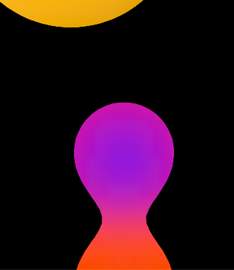

# Eindreflectie

Het project begon wat lastig. Ik wist namelijk vrijwel direct dat ik de Artifaction wilde doen, maar ik had geen idee wat. Toen werd er iets verteld over een techniek met gaussian blur en contrast, deze techniek ken ik en gebruik ik wel eens om pixelige plaatjes "scherper" te maken en ik heb er wel eens een animatie mee gemaakt. Dit was in ProCreate, een programma gebaseerd op pixels, dus het leek me leuk om dat responsive in code te maken.

Toen ben ik eigenlijk een soort van rabbithole ingevallen en een beetje de opdracht uit het oog verloren. Het eindresultaat is dus wel iets waar ik heel trots op ben en waarover ik kan zeggen dat ik er echt iets van heb geleerd. Ik heb het gevoel dat ik enigszins heb gepusht tot wat CSS kan binnen een bepaald gebied.
Maar tegelijkertijd vind ik het niet héél erg bij Artifaction passen.

## Wat ging goed?
Allereerst heb ik het super naar mijn zin gehad en merkte ik dat het onderwerp me echt interesseerde. Dat ik er verder en verder en verder aan wou werken — ik heb mezelf een aantal keer om 00:30 betrapt terwijl ik er nog steeds mee bezig was. Dit was voor mij super fijn om te merken; dit is echt een project geweest waar ik energie van kreeg.

Ik heb het idee dat ik flink wat nieuwe dingen heb geleerd en dat ik vloeiender ben geworden in het schrijven van CSS. Dat is een van mijn leerdoelen en daar ben ik super blij mee.
Het eindproduct vind ik goed gelukt, al is het een soort van half af omdat ik op het laatst problemen kreeg met het gebruiken van een "random" gegenereerde property. Ik heb de knop die die functie aanroept wel laten staan, omdat ik dat voor het eindgesprek van belang vind.
Ik vond het leuk dat ik de motivatie voelde om dat probleem op te lossen, zodanig dat ik op advies van Sanne, Miriam Suzanne heb gemaild.

## Wat ging minder?
Ik merk dat troubleshooten op mezelf matig gaat. Snel heb ik het gevoel dat ik het "gewoon niet weet".
Dan ben ik snel geneigd om het aan AI te vragen omdat die een snel antwoord geeft. Wel lukte het goed om kritisch te kijken naar wat AI schreef en dat te implementeren in plaats van te kopiëren. Vaak was het toch wel zo dat AI compleet willekeurige dingen schreef waar ik uiteindelijk niets aan bleek te hebben. Aan het einde van het project liep ik tegen een probleem aan met het gebruiken van een random value, waarbij ik samen met Nils alle mogelijke problemen heb doorlopen. Het was voor mij super fijn om te zien hoe Nils dat troubleshooten aanpakte.

De tussentijdse reflecties ben ik vaak compleet vergeten en heb ik dus ook grotendeels niet gedaan. Dit komt voornamelijk doordat ik zodra ik in de les kwam enthousiast aan de slag ging met het verbeteren van het project, maar daarin compleet vergat op te schrijven wat ik deed.
Ook heb ik vaak dat ik heel lang aan hele kleine dingetjes zit te sleutelen, terwijl ik eigenlijk beter kan werken aan de volledige basis op niveau krijgen.

## Wat heb ik geleerd?
Ik heb een heel nieuw concept geleerd: svg filters.
Daarbij heb ik geëxperimenteerd met blend modes.
Ook heb ik geleerd over het genereren van een "random" value met alleen CSS, en hoe je dit niet kan gebruiken om een animatie mee aan te sturen. 🙁

Ik heb geleerd over verschillende CSS states die het mogelijk maken checkboxes om te bouwen naar iets interessanters.

Verder heb ik geleerd over troubleshooten en hoe je dat stap voor stap doet.
Ik vind het lastig om concrete dingen op te noemen die ik heb geleerd, mogelijk door het gebrek aan tussentijdse reflectie, maar ook omdat het hartstikke veel kleine dingetjes zijn.
In ieder geval heb ik geleerd te experimenteren met CSS — een soort denkwijze die ik nu meer mijn eigen heb gemaakt, hoe zweverig dat ook klinkt.

## Wat wil ik er nog aan doen?
Ik wil er in de toekomst nog aan toevoegen dat de div's op een random variabele manier animeren.
Ik zou een knop willen toevoegen die door verschillende interessante blendmodes cyclet, waardoor het toch meer dat Artifaction-gevoel oproept.